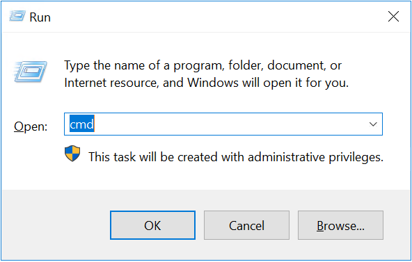
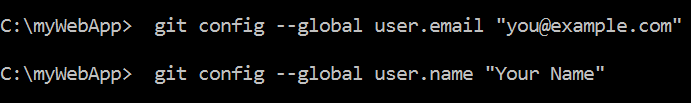
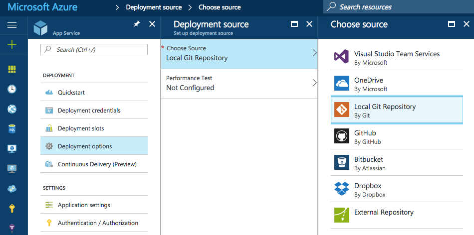
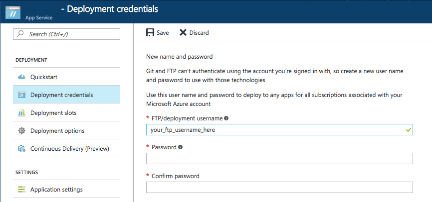
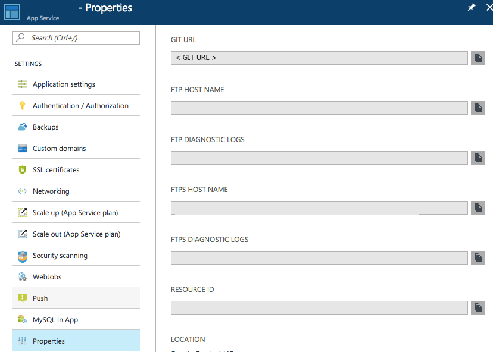
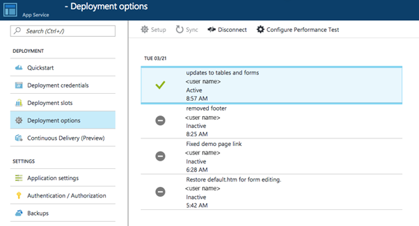
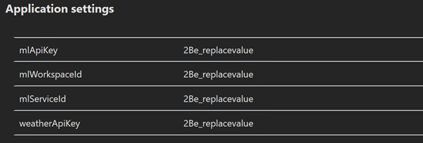
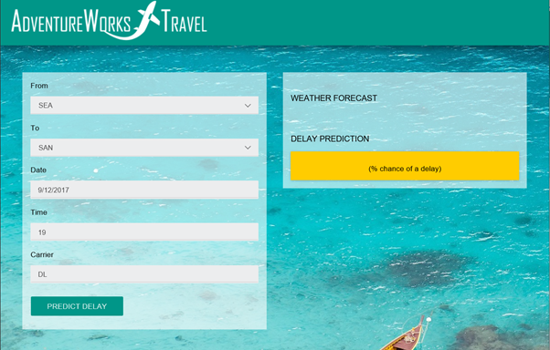

# Exercise 3: Deploy Intelligent Web App

Duration: 20 mins

Synopsis: In this exercise, attendees will deploy an intelligent web application to Azure from GitHub. This application leverages the operationalized machine learning model that was deployed in [Exercise 1](01 Exercise 1 - Building a Machine Learning Model.md) to bring action-oriented insight to an already existing business process.

## Task 1: Deploy Web App from the Lab VM

1. **Open** command prompt by executing "cmd". 

    

2. **Navigate** to "C:\mywebapp" where web app source codes are.

3. **Run** following command from the command shell.

    ``` 
    git config --global user.email "you@example.com"
    git config --global user.name "your name"
    ```
    

## Task 2: Commit your content

1. From the command-line, verify that you are under the **C:\myWebApp** folder. Then use the following command to initialize and add files to your repository.

    ``` git
    git init
    git add -A
    ```
2. Next, **commit** the changes to the repository by using the following command.

    ``` git
    git commit -m “AWTApp”
    ```

## Task 3: Enable the App Service app repository

1. If you are not log in Azure yet please log in to the Azure Portal.

2. In your App Service app's blade, click **Settings > Deployment** source. Click **Choose source**, then click **Local Git Repository** as an option, and then click **OK**.

    

3. If this is your first time setting up a repository in Azure, you need to create login credentials for it. You will use them to log into the Azure repository and push changes from your local Git repository. From your app's blade, click **Settings > Deployment credentials**, then configure your deployment username and password. When you're done, click **Save**.

    

## Task 4: Deploy your project
4. In your app's blade in the Azure Portal, click **Settings > Properties** for the Git URL. Git URL is the remote reference to deploy to from your local repository. You'll use this URL in the following steps. **Copy** the url for later use.

    

5. Using the command-line, verify that you are in the root of your local Git repository.

6. Use git remote command to add the remote reference. **Paste** Git URL that you just copied from the previous step. Your command will look similar to the following.

    ``` git
    git remote add azure https://<username>@localgitdeployment.scm.azurewebsites.net:443/localgitdeployment.git
    ```

7. Push the source codes to Web App Service by running following command.

    ``` git
    git push azure master
    ```

8. Go back to your app in the **Azure Portal**. A log entry of your most recent push should be displayed in the **Deployments > Deployment Option** blade.

    

9. Now we need to update application settings. Go to **Settings > Application Settings** menu from the web app blade. Find **Application settings** and update the values. You can find values from [Exercise 1, Task 7](https://github.com/xlegend1024/CortanaIntelligenceSuiteWorkshopManual2Hrlong/blob/master/01%20Exercise%201%20-%20Building%20a%20Machine%20Learning%20Model.md#task-7-deploy-web-service-and-note-api-information) or [Microsoft Azure Machine Learning Web Services](https://services.azureml.net).

    For the lab, you can use following code for **weatherApiKey**.

    ```
    3a7a579f41f30b09
    ```

    

10. **Congratulations!** You have built and deployed an intelligent system to Azure!

    

Next Exercise: [Exercise 4 - Cleanup of Azure Resources](https://github.com/xlegend1024/CortanaIntelligenceSuiteWorkshopManual2Hrlong/blob/master/04%20Exercise%204%20-%20Cleanup%20of%20Azure%20Resources.md)


--3a7a579f41f30b09
