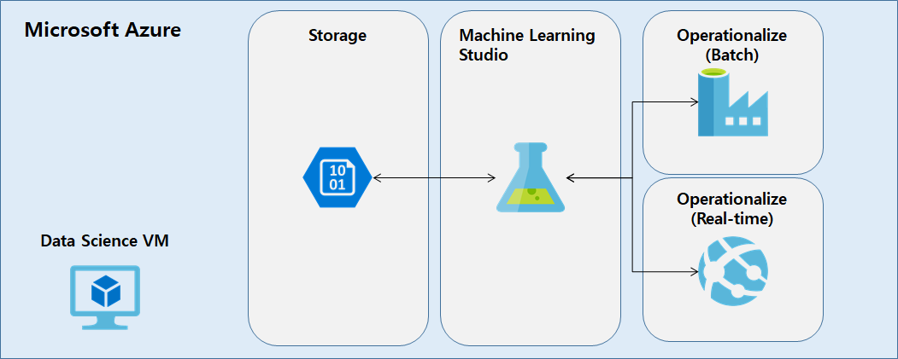

 # Cortana Intelligence Suite End-to-end Workshop

**NOTE:** If you are finding this lab via the [Microsoft Virtual Academy recording](https://mva.microsoft.com/en-us/training-courses/cortana-intelligence-suite-end-to-end-16972): WELCOME!!! We want to let you know that the workshop continues to evolve and you will likely find some differences between what you see in the recording and what you will find in this up-to-date and living manual. For example, after the recording, the first exercise (building an Azure ML model) was changed quite a bit to move more of the steps to R script. The essence of the workshop, however, is still intact and you should be able to follow along.

# Workshop Scenario Overview

AdventureWorks Travel (AWT) provides concierge services for business travelers. In an increasingly crowded market, they are always looking for ways to differentiate themselves and provide added value to their corporate customers.

They are looking to pilot a web-app that their internal customer service agents can use to provide additional information useful to the traveler during the flight booking process. They want to enable their agents to enter in the flight information and produce a prediction as to if the departing flight will encounter a 15 minute or longer delay, taking into account the weather forecasted for the departure hour.

In this workshop, attendees will build an end-to-end solution to predict flight delays taking into account the weather forecast.

# Workshop Architecture
The workshop uses several, but not nearly all, of the components that are part of [Cortana Intelligence Suite](https://www.microsoft.com/en-us/cloud-platform/cortana-intelligence-suite). The goal is to show an end-to-end solution and not necessarily try to work in every component possible. The workshop architecture is below and includes:

- Azure ML
- Azure Data Factory
- Azure Storage
- HDInsight Spark
- Power BI
- Azure App Service

# Requirements

- Microsoft Azure Subscription should be pay-as-you-go, MSDN, or EA.
   - If you are using your company's Azure subscription and your company requries that you be connected to your corporate network (through a VPN or otherwise), we recommend that you use a Trial or MSDN subscription for this workshop. This is due to the fact that you will be connecting to your subscription inside of a VM that is not connected to your corporate network.
   - Recommendation is to have each user have their own Azure subscription. This will allow every attendee to have their own sandbox.
- Setup is required before performing the steps in these exercises. Please see [http://aka.ms/cortanasetup](http://aka.ms/cortanasetup) before going any further.
- Please keep in mind that HDInsight cluster and VM you provision as setup for this workshop will incur charges, so provision these resources closest to the workshop date as possible.  Preferably the afternoon/night before the workshop.

# Exercises
- [Prereq   0 - Deploy Workshop Environment to Azure](https://github.com/xlegend1024/CortanaIntelligenceSuiteWorkshopManual/blob/master/00%20Deploy%20Workshop%20Environment%20to%20Azure.md)
- [Exercise 1 - Building a Machine Learning Model](https://github.com/xlegend1024/CortanaIntelligenceSuiteWorkshopManual/blob/master/01%20Exercise%201%20-%20Building%20a%20Machine%20Learning%20Model.md)
- [Exercise 2 - Setup Azure Data Factory](https://github.com/xlegend1024/CortanaIntelligenceSuiteWorkshopManual/blob/master/02%20Exercise%202%20-%20Setup%20Azure%20Data%20Factory.md)
- [Exercise 3 - Develop Data Factory Pipeline for Data Movement](https://github.com/xlegend1024/CortanaIntelligenceSuiteWorkshopManual/blob/master/03%20Exercise%203%20-%20Develop%20Data%20Factory%20Pipeline%20for%20Data%20Movement.md)
- [Exercise 4 - Operationalize ML Scoring with Azure ML and Data Factory](https://github.com/xlegend1024/CortanaIntelligenceSuiteWorkshopManual/blob/master/04%20Exercise%204%20-%20Operationalize%20ML%20Scoring%20with%20Azure%20ML%20and%20Data%20Factory.md)
- [Exercise 5 - Summarize Data Using HDInsight Spark](https://github.com/xlegend1024/CortanaIntelligenceSuiteWorkshopManual/blob/master/05%20Exercise%205%20-%20Summarize%20Data%20Using%20HDInsight%20Spark.md)
- [Exercise 6 - Visualizing in Power BI Desktop](https://github.com/xlegend1024/CortanaIntelligenceSuiteWorkshopManual/blob/master/06%20Exercise%206%20-%20Visualizing%20in%20Power%20BI%20Desktop.md)
- [Exercise 7.1 - Acquire Weather API Key](https://github.com/xlegend1024/CortanaIntelligenceSuiteWorkshopManual/blob/master/07%20Exercise%207.1%20-Acquire%20Weather%20API%20Key.md)
- [Exercise 7.2 - Deploy Intelligent Web App](https://github.com/xlegend1024/CortanaIntelligenceSuiteWorkshopManual/blob/master/07%20Exercise%207.2%20-%20Deploy%20Intelligent%20Web%20App.md)
- [Exercise 8 - Cleanup of Azure Resources](https://github.com/xlegend1024/CortanaIntelligenceSuiteWorkshopManual/blob/master/08%20Exercise%208%20-%20Cleanup%20of%20Azure%20Resources.md)
- [Appendix A - Alternative to Azure ML Exercise](https://github.com/xlegend1024/CortanaIntelligenceSuiteWorkshopManual/blob/master/09%20Appendix%20A%20-%20Alternative%20to%20Azure%20ML%20Exercise.md)
- [Appendix B - Alternative to Azure Data Factory Exercises](https://github.com/xlegend1024/CortanaIntelligenceSuiteWorkshopManual/blob/master/10%20Appendix%20B%20-%20Alternative%20to%20Data%20Factory%20Exercises.md)
