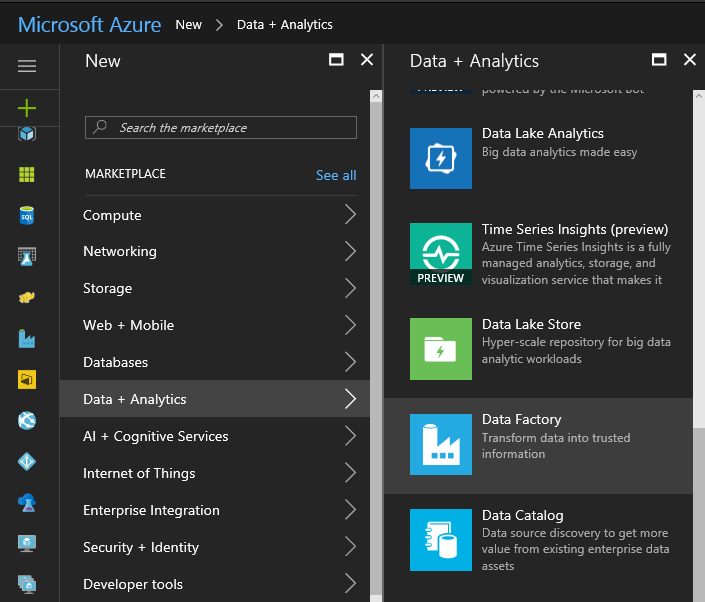

# Check Workshop environment

Duration: 10 mins

* [Task 1: Log in to the Azure Portal](#task-1-log-in-to-the-azure-portal)
* [Task 2: Create new Azure Data Factory Service](#task-2-create-new-azure-data-factory-service)

## Task 1: Log in to the Azure Portal

1. Launch a new browser session and navigate to [https://portal.azure.com](https://portal.azure.com). Once prompted, log in with your Microsoft Azure credentials. If prompted, choose whether your account is an organization account or a Microsoft Account.  This will be based on which account was used to provision your Azure subscription that are using for these labs.
   - **Note** : You may need to launch an InPrivate/Incognito session in your browser if you have multiple Microsoft Accounts.

## Task 2: Create new Azure Data Factory Service

1. From left top corner of the Azure Portal, click on **+New**.

    

1. Select **Data + Analytics** , click on **Data Factory**.

    

1. Provide a name like [insert your initial here]-adf (example **jcho-adf** ).
2. Make sure to you have the right subscription selected.
3. For Resource Group, choose **Use Existing** and select the Resource Group you created when deploying the workshop prerequisites.
4. Select **East US** or **West US** for the region.
5. Check the box **Pin to dashboard** and click on the **Create** button.

    

1. Deployment of the ADF will take couple of minutes.
2. Once it has completed, you will be taken to the Data Factory blade.
3. Click on **Author and deploy**.

    

1. Click on **…More**.

    

1. Click on **New data gateway**.

    

1. Type in a **Data gateway name** like [insert your initial here]-dmg (example **jcho-dmg** ).
2. Click **OK** button.
3. Click on **Configure** and copy out the **NEW KEY**.

    

4. _Don't close the current browser session._
5. Go back to the Remote Desktop session of the virtual machine.
6. Paste the **Key** into the box in the middle of the screen.

    

1. Click on the **Register** button.
2. It will take couple of minutes to register. If it takes more than couple minutes and the screen does not respond or get an error message, then close the screen by click on the **Cancel** button.
3. You should see below screen with confirmation message.

    

1. You can go back to the Azure Data Factory browser page within the Azure Portal, and Click **OK** twice to finish setting up the Data gateway.

    

