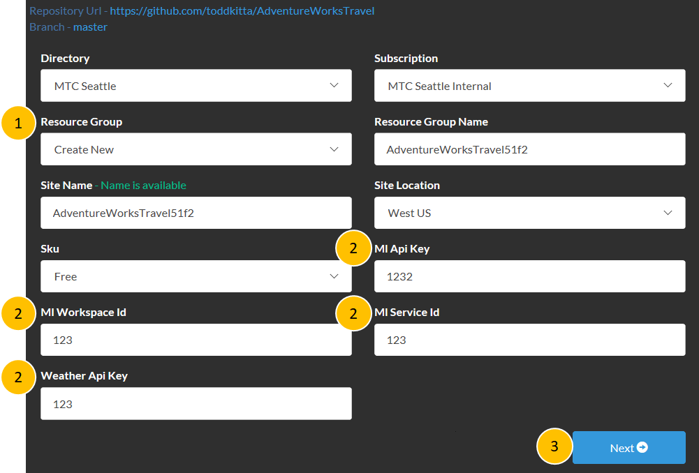

# Create Azure Web App 

Duration: 10 mins

* [Task 1: Log in to the Azure Portal](#task-1-log-in-to-the-azure-portal)
* [Task 2: Create new Azure Data Factory Service](#task-2-Create-web-app)

## Task 1: Log in to the Azure Portal

1. Launch a new browser session and navigate to [https://portal.azure.com](https://portal.azure.com). Once prompted, log in with your Microsoft Azure credentials. If prompted, choose whether your account is an organization account or a Microsoft Account.  This will be based on which account was used to provision your Azure subscription that are using for these labs.
   - **Note** : You may need to launch an InPrivate/Incognito session in your browser if you have multiple Microsoft Accounts.

## Task 2: Create Web App

0) Click follwing link to create a web app

1) Select 'Create New' for Resource Group. Resource Group Name will be automatically created.

2) Use '123' for following parapeters, and click next.
* MI Api Key
* MI Workspace Id
* MI Service Id
* Weather Api Key 

3) Click 'Next' and 'Deploy' at the following steps. 

If there is an issue or failed to create resources, please copy or take the screenshot of the error and forward it to me.
